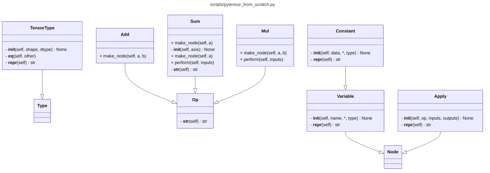

```mermaid
---
title: scripts/pytensor_from_scratch.py
---
classDiagram
    class Type

    class Op {
        - __str__(self) str
    }

    class Node

    class Variable {
        - __init__(self, name, *, type) None
        - __repr__(self) str
    }

    class Apply {
        - __init__(self, op, inputs, outputs) None
        - __repr__(self) str
    }

    class TensorType {
        - __init__(self, shape, dtype) None
        - __eq__(self, other)
        - __repr__(self) str
    }

    class Add {
        + make_node(self, a, b)
    }

    class Sum {
        + make_node(self, a)
    }

    class Constant {
        - __init__(self, data, *, type) None
        - __repr__(self) str
    }

    class Sum {
        - __init__(self, axis) None
        + make_node(self, a)
        + perform(self, inputs)
        - __str__(self) str
    }

    class Mul {
        + make_node(self, a, b)
        + perform(self, inputs)
    }

    Variable --|> Node

    Apply --|> Node

    TensorType --|> Type

    Add --|> Op

    Sum --|> Op

    Constant --|> Variable

    Mul --|> Op
```
